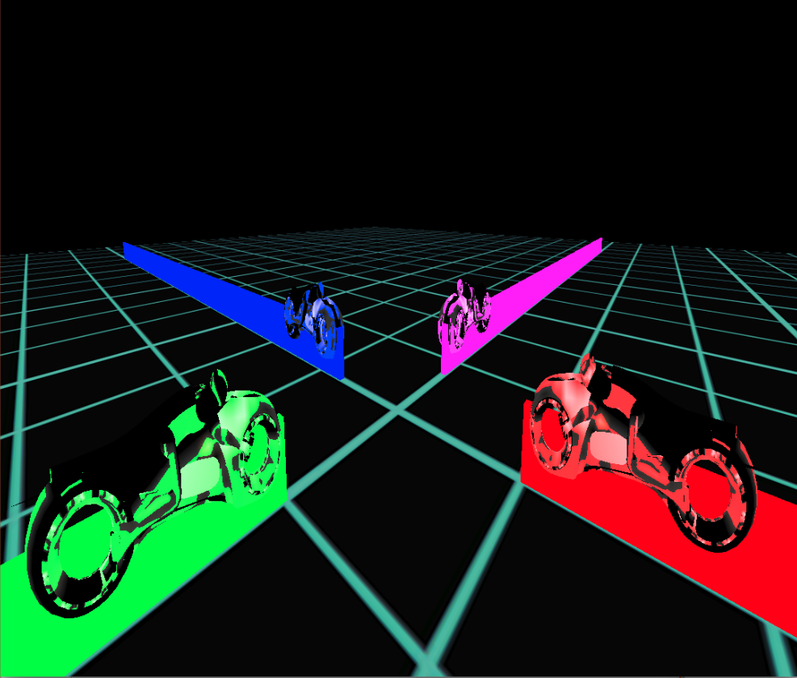

# TronGL project

## Authors
- Damien Diguet 
- Levan Kapanadze 
- Pierre Bebin 
- Ludovic Marechal

## Overview         
Arcade game inspired by Tron movie. Multiple light-bikes controlled by an AI or human trying to destroy each other by forcing them to smash into the wall or the trace left after light-bikes.

## Build
To build the game, clone it from this git then run these commands.

		cd TronGL
		cmake .
		make
	
## Run
To run the game, use this command in TronGL folder.

		./TronGL

## Features
- Manual Control
- AI opponents
- Different camera views
- 3D battle arena
- Split screen for multiplayer game

## Controls
Controls for this game are simple to learn. For each player, set of keys follows the same pattern on different part of the keyboard. 	
	
### General Controls
		P : Pause the game and change camera
		
		Mouse : Orientate camera
		Z : Move camera forward
		S : Move backward camera
		Q : Left straf camera
		D : right straf camera
		
	
### Player 1
		← and → : Turn bike
		↑ : Use boost
	
### Player 2
		F and H : Turn bike
		T : Use boosts
		
## Technical Details
- Viewport
	- 3rd-person or free camera view
	- Multiple viewport for multiplayer game
- Textures
	- Wall and bike colors according to player.
	- Neon effect on the ground by changing white part of the ground according to time 
- Animation
	- Particle effects at the beginning of the game
- Sound effects
	- Background music
	- Explosion, engine and boost sounds

## Demo
